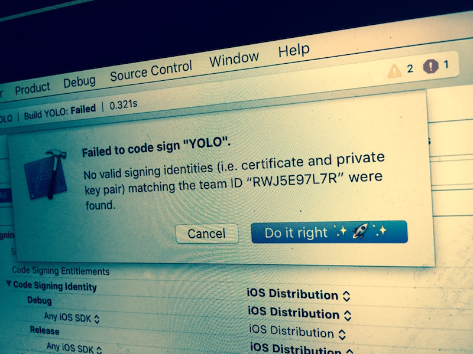
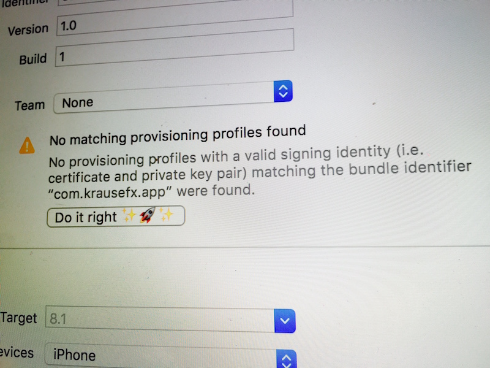

<p align="center">

</p>

<h3 align="center">
FixCode
</h3>

<p align="center">
Fixing the <code>Fix Issue</code> button
</p>

This Xcode plugin disables the `Fix Issue` functionality in Xcode. This way, none of your team members can click this button by mistake and might end up revoking existing certificates and provisioning profiles.


|  | Fix Issue
----------------------|----------------------------------
:lock: | Avoid breaking existing profiles when clicking the `Fix Issue` button
:rocket: | Saves you **hours** of dealing with code signing
:sparkles: | Super easy installation
:computer: | Support for iOS, OS X, watchOS and tvOS projects



# Installation

### Using fastlane

Add the `install_xcode_plugin` to your `Fastfile`. This way, the plugin gets installed for the whole team, so that no one can revoke your certificate by mistake.

```ruby
lane :xcode do
  install_xcode_plugin(
    url: "https://github.com/fastlane/FixCode/releases/download/0.1.0/FixCode.xcplugin.zip"
  )
end
```

```
fastlane xcode
```

### Alcatraz
You can install `FixCode` using [Alcatraz](http://alcatraz.io/). 

First, install [Alcatraz](http://alcatraz.io/) using

```
curl -fsSL https://raw.githubusercontent.com/supermarin/Alcatraz/deploy/Scripts/install.sh | sh
```

- Restart Xcode
- Click on `Window`
- Select `Package Manager`
- Search and Install `FixCode`
- Restart Xcode

# What does this do?

The primary goal of this plugin is to **disable** the original `Fix Issue` button, as it has side effects, like sometimes [revoking your certificates and with it all its provisioning profiles](https://raw.githubusercontent.com/fastlane/sigh/master/assets/SignErrors.png).

This is especially a big problem when working in a bigger team: Someone clicks the `Fix Issue` button and revokes the other profiles. This includes Enterprise profiles, resulting in breaking the app on all devices it's installed on.

This Xcode plugin will deactivate the button and replace it with emojis. The button will open the [official code signing guide](https://github.com/fastlane/fastlane/blob/master/docs/CodeSigning.md).

You might ask yourself, why the button doesn't just run [sigh](https://github.com/fastlane/sigh) or [cert](https://github.com/fastlane/cert): Check out the [blog post about developer tools by Felix Krause](https://krausefx.com/blog/ios-tools) for more information about how developer tools should be transparent and show you what they do.



# Thanks

- The code was implemented by [@neonacho](https://twitter.com/neonacho)
- [@KrauseFx](https://twitter.com/KrauseFx) was also there, providing drinks while [@neonacho](https://twitter.com/neonacho) did the actual work.

# Need help?
Please submit an issue on GitHub and provide information about your setup

# License
This project is licensed under the terms of the MIT license. See the LICENSE file.

> This project are in no way affiliated with Apple Inc. This project is open source under the MIT license, which means you have full access to the source code and can modify it to fit your own needs. This tool run on your own computer or server, so your credentials or other sensitive information will never leave your own computer. You are responsible for how you use this tool.

