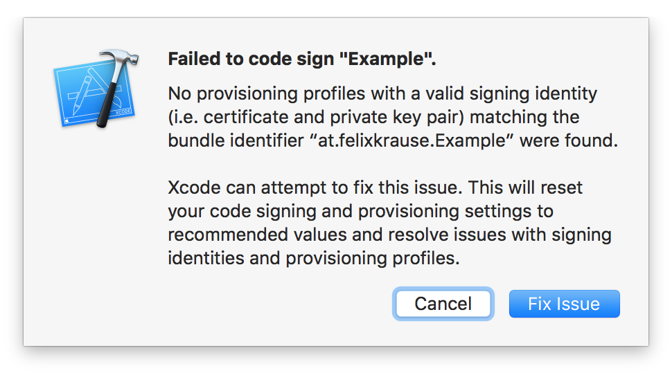

FixCode
=======

####### Fixing the `Fix Issue` button



|  | Fix Issue
----------------------|----------------------------------
:sparkles: | Get the most out of the built-in `Fix Issue` button
:wrench: | A lot of extra functionality
:thought_balloon: | You've never seen something this amazing!
:tophat: | Used by over 2 developers around the world
:email: | Support for Xcode
:page_with_curl: | Streamlines your signing process
:rocket: | Saves you **hours** of dealing with code signing
:pencil2: | Very flexible configuration, just click the button
:mountain_cableway: | Fully automatic, nothing you need (or can) do
:ghost: | No more bad surprises
:book: | Built-in documentation
:hatching_chick: | Over 90KB of network requests
:computer: | Support for iOS, Mac, WatchOS and Apple TV Projects
:octocat: | Full git support

# Installation

The recommended way to install `FixCode` is using [Alcatraz](http://alcatraz.io/). 

Install [Alcatraz](http://alcatraz.io/) using

```
curl -fsSL https://raw.githubusercontent.com/supermarin/Alcatraz/deploy/Scripts/install.sh | sh
```

- Restart Xcode
- Click on `Window`
- Select `Package Manager`
- Search and Install `FixCode`
- Restart Xcode

# Thanks

Special thanks to Apple Inc for providing the initial "Fix Issue" functionality. Without it, this project wouldn't be possible.

- The code was implemented by [@neonacho](https://twitter.com/neonacho)
- [@KrauseFx](https://twitter.com/KrauseFx) was also there, providing drinks while [@neonacho](https://twitter.com/neonacho) did the actual work.

# Need help?
Please submit an issue on GitHub and provide information about your setup

# License
This project is licensed under the terms of the MIT license. See the LICENSE file.

> This project are in no way affiliated with Apple Inc. This project is open source under the MIT license, which means you have full access to the source code and can modify it to fit your own needs. This tool run on your own computer or server, so your credentials or other sensitive information will never leave your own computer. You are responsible for how you use this tool.

